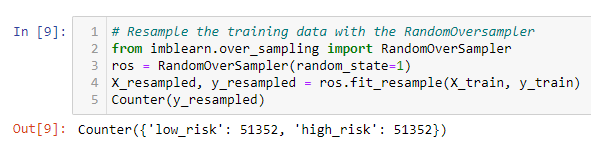

# Credit Risk Analysis

## Overview
Python was used to build and evaluate six machine learning models to predict credit risk from the LeandingClub dataset provided. The six machine learning models used in this project are as follows:
* RandomOverSampler to oversample data.
* SMOTE to oversample data.
* ClusterCentroids to undersample data.
* SMOTEENN use to use a combination of over- and undersampling.
* BalancedRandomForestClassifier to reduce bias and predict credit risk.
* EasyEnsembleClassifier to reduce bias and predict credit risk.

## Results

### Naive Random Oversampling
* `RandomOverSampler` 
  * **Balanced Accuracy**: 0.6515938052705158
  * **Precision**: 
  * **Recall**: 0.62 (High_Risk) / 0.68 (Low_Risk)

### SMOTE Oversampling
* `SMOTE`
  * **Balanced Accuracy**: 0.6241876870888075
  * **Precision**: 
  * **Recall**: 0.59 (High_Risk) / 0.66 (Low_Risk)

### Undersampling
* `ClusterCentroids`
  * **Balanced Accuracy**: 0.6241876870888075
  * **Precision**: 
  * **Recall**: 0.60 (High_Risk) / 0.43 (Low_Risk)

### Combination (Over and Under) Sampling
* `SMOTEENN`
  * **Balanced Accuracy**: 0.5161072635781654
  * **Precision**: 
  * **Recall**: 0.70 (High_Risk) / 0.58 (Low_Risk)

### Ensemble Learners
* `BalancedRandomForestClassifier`
  * **Balanced Accuracy**: 0.7877672625306695
  * **Precision**: 
  * **Recall**: 0.67 (High_Risk) / 0.91 (Low_Risk)

* `EasyEnsembleClassifier` 
  * **Balanced Accuracy**: 0.925427358175101
  * **Precision**: 
  * **Recall**: 0.91 (High_Risk) / 0.94 (Low_Risk)

### Summary
